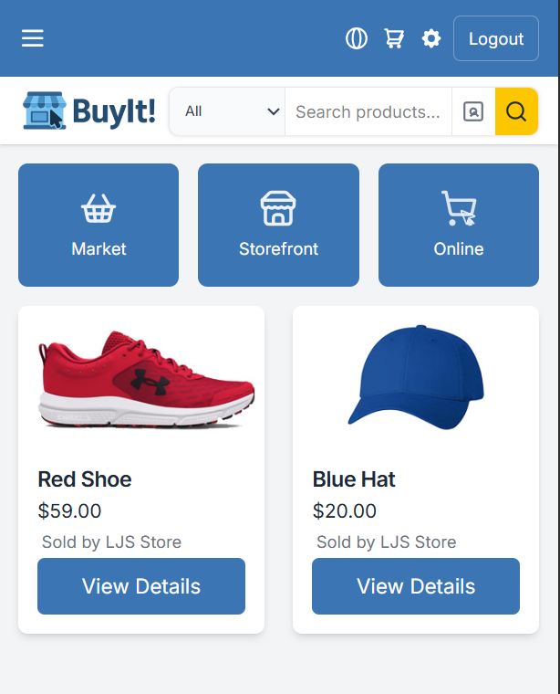
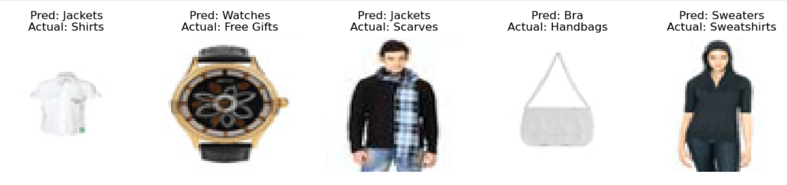
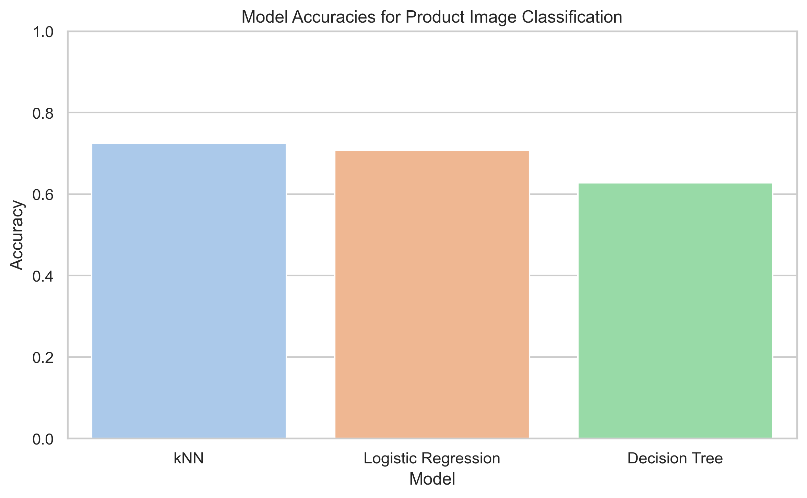
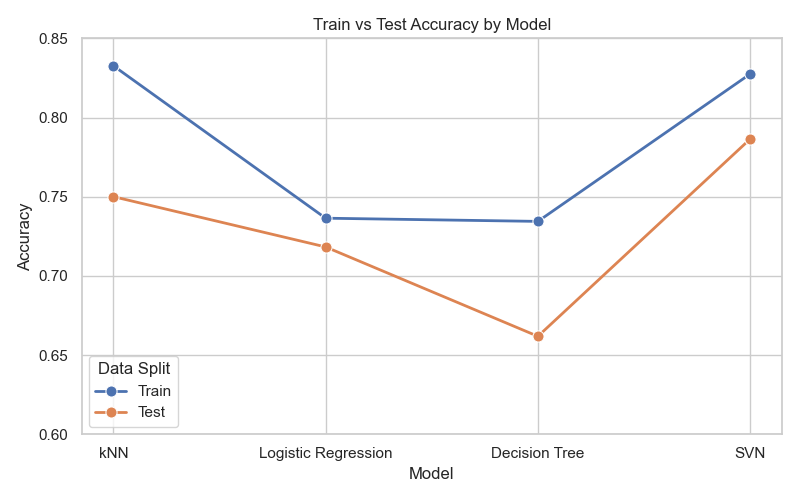
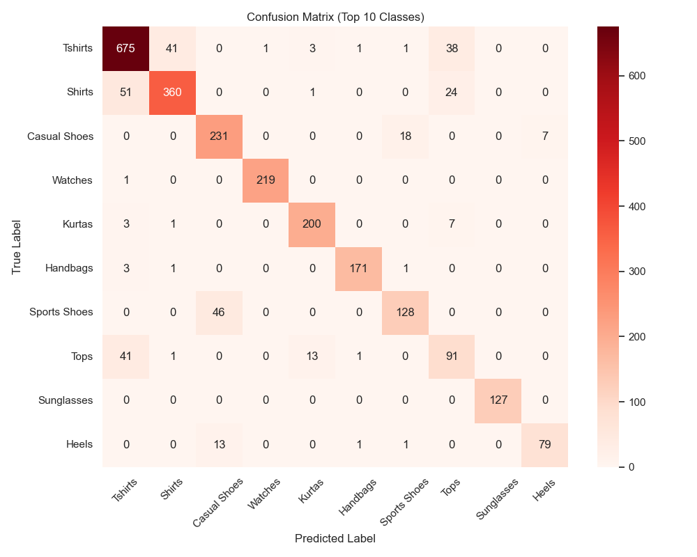

<h2>
  
  BuyIt! Image Classification
</h2>

**Author**
Lori Smith

#### Executive summary

This project introduces a web-based e-commerce platform designed to support small and local businesses by offering customers a visual search experience powered by image classification. The platform enables users to upload or browse product images and discover visually similar items being sold by nearby merchants. By leveraging machine learning, this tool bridges the gap between small retailers and the advanced search capabilities available to large e-commerce platforms.

The end goal is twofold: to improve discoverability for small merchants and to provide customers with a more intuitive and visual way to shop locally. This project combines frontend development, backend systems, and image-based AI to deliver a real-world solution that promotes both innovation and community impact.

  

#### Rationale
Why should anyone care about this question?

Small business needs a way to compete with large business.  Using some of the AI image tools helps them to have similar tools that big tech has.

This project matters because it empowers small, local businesses to compete with large e-commerce platforms like Amazon. By enabling customers to visually search for products available nearby, we help drive foot traffic and online orders to independent shops that often struggle with visibility online. For consumers, it provides a fast, intuitive way to find what they need locally—potentially reducing wait times and environmental impact from shipping.

From a broader social perspective, this type of platform strengthens local economies and fosters community connections. On a personal level, this project also enables me to gain experience with image-based machine learning, which is a step toward solving more complex problems involving 3D graphics and AI—my background and future goal.

#### Research Question
What are you trying to answer?

How can image classification be used to support visual product search in a local shopping platform like BuyIt.store, which connects small businesses with nearby customers?

#### Data Sources
What data will you use to answer you question?

I am using the Fashion Product Images Dataset available on Kaggle:

Dataset: https://www.kaggle.com/datasets/paramaggarwal/fashion-product-images-datasetLinks to an external site.
Sample Classifier: https://www.kaggle.com/code/paramaggarwal/fashion-product-images-classifierLinks to an external site.

#### Methodology
What methods are you using to answer the question?  

I plan to implement and compare the following classification algorithms to determine which best classifies product images:

* Decision Trees
* Logistic Regression
* K-Nearest Neighbors (KNN)
* Support Vector Classifier (SVC)
* Neural Networks

#### Results
What did your research find?

The initial model runs had mixed results. I trained and evaluated KNN, Decision Tree, and Logistic Regression models. SVM would not run with the full dataset due to memory constraints. After applying dimensionality reduction, I reran the models and achieved promising results with 78% accuracy. The images below show some of the misclassified samples. Viewing the actual images helps explain why the model may have struggled to classify them correctly.

Here were some of the results based on my initial tests.
The most successful model in my initial tests was the KNN Classifier with a 72.5% accuracy. With 20462 items in the dataset, SVN was stuck. 
I found that SVN was taking too long to process after a half hour of waiting for a result. I ended up using decomposition with PCA to reduce the number of points to send to SVN down to 100.  This significantly improved performance, and the accuracy increased to 78%, despite some known issues in the dataset and label quality.

After a few tweaks in the data the graph above shows the test and training data accuracies.

The heatmap image above confirmed what I saw when looking through the values of the prediction data. The shirts, t-shirt, and tops labels were often incorrectly categorized.  The different subcategories of shoes were also commonly misclassified.  Sports shoes and casual shoes often confused the models as well.

#### Next steps
What suggestions do you have for next steps?

A better dataset with more accurate labeling would help.  Also some of the data is shown worn on a user making it harder to categorize.  For example a man is wearing a jacket and a scarf and the image is classified as jacket when it should be classified as scarf.  Some of the mistakes that are being made are because of poor labeling. I did drop the category "Free Gifts" because that was not helpful information in defining a classification for the item.

Instead of changing my dataset right now, I could choose to consolidate some of the categories.  For example, shirts, t-shirts, and tops are all categories and they are consistently getting miscategorized.  By making one "tops" category that combines all of these types the results will likely be better.  I am hesitant to try that until I see what the results of neural networking are.  Since SVN with decomposition was able to get to 78% on the test set, I want to see what the results are with neural networking before further altering the dataset.  Perhaps it will be able to distinguish between some of the categories that the other models weren't able to. 

I am excited to explore neural networks in the upcoming module. Once we cover them in class, I plan to revisit this project and apply a neural network model to the dataset to compare its performance with the traditional machine learning methods used so far.

#### Outline of project

- [Link to Capstone notebook 1](https://github.com/lorigreensmith06/AIML_Capstone/blob/main/capstone_image_search.ipynb)

##### Contact and Further Information
**Name:** Lori Smith  

**Email:** lorigreensmith@gmail.com

**GitHub:** [github.com/lorigreensmith06](https://github.com/lorigreensmith06)  

This project is part of the AI/ML Capstone and was completed using Python and Scikit-learn. For more details or source code, please visit the GitHub repository linked above.