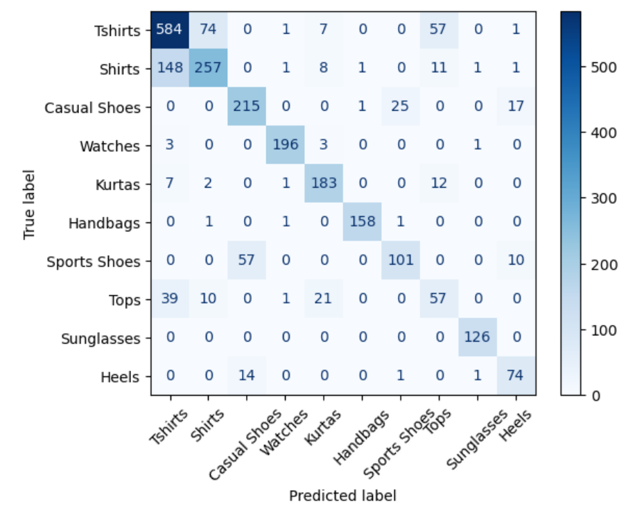
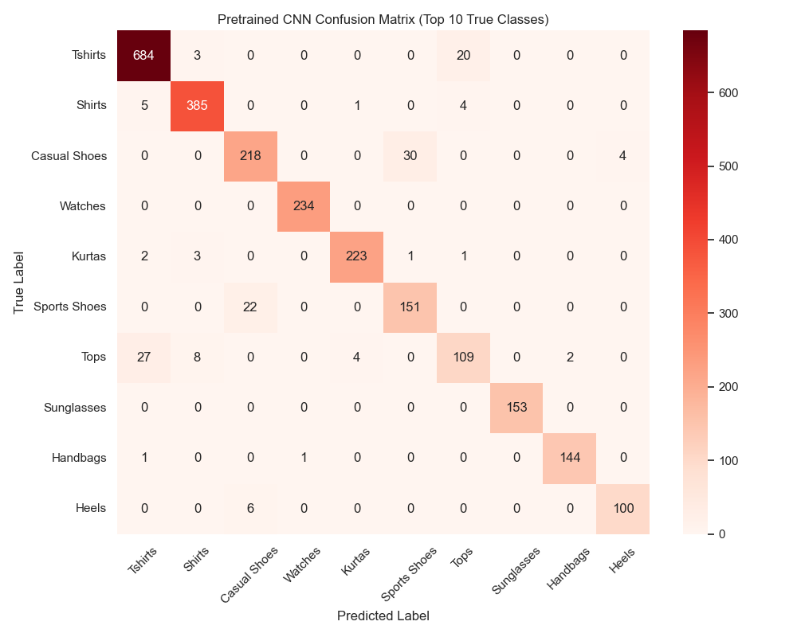

<h2>
  
  BuyIt! Image Classification
</h2>

**Author**
Lori Smith

#### Executive summary

This project introduces a web-based e-commerce platform designed to support small and local businesses by offering customers a visual search experience powered by image classification. The platform enables users to upload or browse product images and discover visually similar items being sold by nearby merchants. By leveraging machine learning, this tool bridges the gap between small retailers and the advanced search capabilities available to large e-commerce platforms.

The end goal is twofold: to improve discoverability for small merchants and to provide customers with a more intuitive and visual way to shop locally. This project combines frontend development, backend systems, and image-based AI to deliver a real-world solution that promotes both innovation and community impact.

  

#### Rationale

Small business needs tools to compete with large corporations.  Using some of the AI image tools helps them to have similar tools that big tech has.

This project matters because it empowers small, local businesses to compete with large e-commerce platforms like Amazon. By enabling customers to visually search for products available nearby, we help drive foot traffic and online orders to independent shops that often struggle with visibility online. For consumers, it provides a fast, intuitive way to find what they need locally, potentially reducing wait times and environmental impact from shipping.

From a broader social perspective, this type of platform strengthens local economies and fosters community connections. On a personal level, this project also enables me to gain experience with image-based machine learning, which is a step toward solving more complex problems involving 3D graphics and AI, my background and future goal.

#### Research Question

How can image classification be used to support visual product search in a local shopping platform like BuyIt.store, which connects small businesses with nearby customers?

#### Data Sources

I am using the Fashion Product Images Dataset available on Kaggle:

Dataset: https://www.kaggle.com/datasets/paramaggarwal/fashion-product-images-datasetLinks to an external site.
Sample Classifier: https://www.kaggle.com/code/paramaggarwal/fashion-product-images-classifierLinks to an external site.

#### Data Preprocessing and Preparation

After doing some preliminary modeling tests, I started to find some issues that needed data cleaning.
The images below show some of the misclassified samples. Viewing the actual images helped to understand the data and clean it up.

Taking "Free Gifts" out of the dataset was helpful, because that classification would confuse the models and not be helpful in classification. A watch categorized as "Free Gifts"  would not be helpful in my business context.

One of the main things that had to be done as well was to prepare the images for the correct format for each model. For example, the SVM model needs images of size 64×64 pixels, converted to grayscale and flattened into a 1D vector. The custom CNN model also uses 64×64 grayscale images but keeps the channel dimension, resulting in a shape of (64, 64, 1). The pretrained CNN model, on the other hand, requires RGB images resized to 128×128 pixels, with values normalized between 0 and 1. It's important to make sure the images are in the right format for each model, so they work properly and don’t cause errors during training or testing. This also helps the models perform better.

#### Methodology

I implemented and compared the following classification algorithms to determine which best classifies product images:

* Decision Trees
* Logistic Regression
* K-Nearest Neighbors (KNN)
* Support Vector Classifier (SVC)
* Neural Networks
* Pre-trained Neural Network with Fine Tuning 

#### Results

The initial model runs had mixed results. I trained and evaluated KNN, Decision Tree, and Logistic Regression models. SVM would not run with the full dataset due to memory constraints. After applying dimensionality reduction, I reran the models and achieved promising results with 78% accuracy. 

Here were some of the results based on my initial tests.
The most successful model in my initial tests was the KNN Classifier with a 72.5% accuracy. With 20462 items in the dataset, SVM was stuck. 
I found that SVM was taking too long to process after a half hour of waiting for a result. I ended up using decomposition with PCA to reduce the number of points to send to SVM down to 100.  This significantly improved performance, and the accuracy increased to 78%, despite some known issues in the dataset and label quality.

After learning neural networks I was able to test with CNN and pretrained CNN models.  This proved to be very successful.  The models improved by a lot.  My custom network was already successful getting to an accuracy of over 80% which had been the highest accuracy.

After a few tweaks in the data the graph above shows the test and training data accuracies.

The heatmap images above confirmed what I saw when looking through the values of the prediction data. The shirts, t-shirt, and tops labels were often incorrectly categorized.  The different subcategories of shoes were also commonly misclassified.  Sports shoes and casual shoes often confused the models as well.
Both the custom and pre-trained CNN models considerably improved the results and had better accuracy and fewer false positives and false negatives. 

#### Top Model Classifications
The top models were the SVC(), the custom CNN model and the Pretrained model.  By comparing the accuracies of each top model I could see which categories performed best in each model.  The results are shown below.  The graph shows that even though the pretrained model had the highest accuracy overall, my custom CNN model performed better on the categories Casual Shoes and Tops than the pretrained, fine-tuned model. 

#### Ensemble Techniques
After using Ensemble techniques, the accuracy shot up to 92% leading to the conclusion that accuracy can be greatly improved if using the strengths of multiple models.  Below is the the image of the final test accuracies for all models. 
 

### Next steps

A more accurate and consistently labeled dataset would significantly reduce false positives. In several cases, images include models wearing multiple items, such as a scarf and jacket, but the image is labeled as only one — leading to confusion during training and misclassifications during testing. For example, an image showing a man wearing both a scarf and a jacket was labeled as "scarf," but the model predicted "jacket," which is understandable given the visual dominance of the jacket in the image. This highlights the importance of clearer labeling and more specific annotation guidelines. I also removed the "Free Gifts" category, as it added noise and did not contribute meaningfully to the classification task.

The next logical step would be to deploy the best-performing models in the BuyIt! project to enable automated tagging and filtering of new listings. This could improve search relevance for users and streamline the listing process for sellers.

### Conclusions

Based on the results, it is clear that image classification is achievable even with a dataset that contains noise and ambiguous labels. Despite these challenges, neural network models, particularly the custom CNN and pretrained CNN, were able to achieve high accuracy. This demonstrates the robustness of deep learning methods, even in less-than-ideal data conditions. Such classification models could be especially useful in applications like image-based search and automatic categorization of user-uploaded content, such as in the BuyIt! platform.

#### Outline of project

- [Link to Capstone notebook 1](https://github.com/lorigreensmith06/AIML_Capstone/blob/main/capstone_image_search.ipynb)

##### Contact and Further Information
**Name:** Lori Smith  

**Email:** lorigreensmith@gmail.com

**GitHub:** [github.com/lorigreensmith06](https://github.com/lorigreensmith06)  

This project is part of the AI/ML Capstone and was completed using Python and Scikit-learn. For more details or source code, please visit the GitHub repository linked above.
